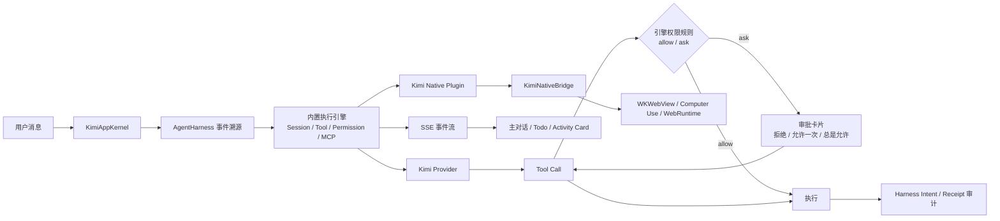
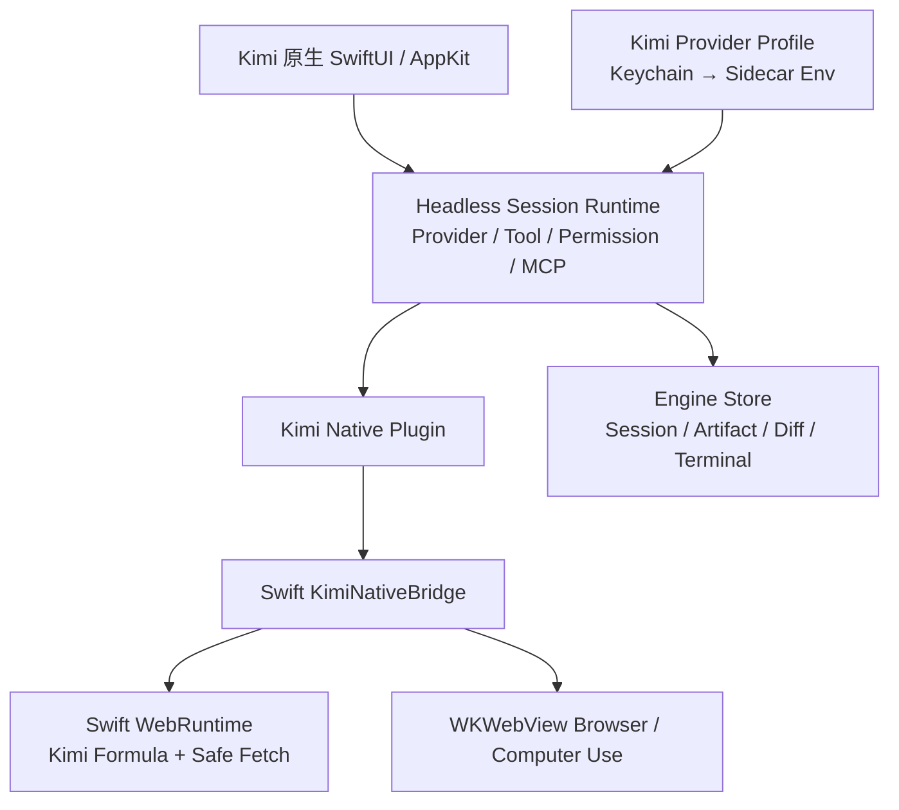

<div align="center">


# Kimi Code Agent

**接入 Kimi 大模型与 macOS 原生能力的本地优先 Coding Agent 工作台**

自然对话 · Worktree 隔离 · 可审计工具 · MCP / Skills / Hooks · 可恢复执行

<p>
  
  
  
  
</p>

</div>

> 当前生产桌面工作台是 Kimi 原生 SwiftUI/AppKit；内置执行引擎只监听随机 loopback 端口，无界面运行。用户不需要手动安装 Node/Bun，默认在本机和隔离 Worktree 中执行，审阅 Diff 后再合并。

## 目录

- [它解决什么问题](#它解决什么问题)
- [执行闭环](#执行闭环)
- [能力地图](#能力地图)
- [快速开始](#快速开始)
- [权限与安全](#权限与安全)
- [架构](#架构)
- [项目结构](#项目结构)
- [从源码构建](#从源码构建)
- [发布与校验](#发布与校验)
- [故障排查](#故障排查)
- [当前边界](#当前边界)

## 它解决什么问题

Kimi Code Agent 的重点不是把更多按钮塞进界面，而是把一次 Coding Agent 任务变成一条可理解、可暂停、可恢复、可审计的链路：

```text
用户消息
  → 意图识别
  → Supervisor / Child Agent 调度
  → Tool Schema 校验
  → 权限判断
  → Effect Intent
  → Worktree / MCP / Browser / Terminal 执行
  → Receipt 与 Artifact
  → 测试和验证
  → 失败恢复或自动修复
  → 中文最终答案
```

主对话只展示结论、证据和下一步；工具原始 JSON、终端长输出和内部推理进入可折叠 Activity Card 或 Artifact Viewer，不污染聊天内容。

## 执行闭环



- 内置引擎（opencode 派生）是唯一执行链：会话循环、工具注册、权限判定、压缩与子代理都在引擎内完成；
- Swift 侧 Harness 对每次工具调用事后补记 Intent/Receipt（含输入输出 sha256 摘要），用于审计、统计与崩溃恢复，绝不伪造成功回执；
- 需要联网、浏览器验证或系统级操作的工具由引擎插件转发给一次性 `KimiNativeBridge` 进程，桥端再做一次 URL/审批校验；
- 主对话只展示结论、证据和下一步；工具原始 JSON、终端长输出和内部推理进入可折叠 Activity Card，不污染聊天内容。

### 交互语义

- **停止**：执行中随时点停止按钮，引擎中断当前 turn；
- **插队（Steer）**：执行中发送的消息进入正在运行的 turn，引擎在下一个循环边界拾起；
- **排队（Follow-up）**：排队消息在当前 turn 结束后自动开始新一轮；
- **撤销**：消息级 `revert` 回滚该轮文件改动，`unrevert` 还原；
- **恢复**：应用重启后从引擎消息日志重建对话、Todo 与工具活动；未结算的本地 Operation 标记 `suspended`，副作用绝不自动重放。

## 能力地图

| 能力 | 默认执行位置 | 用户看到的结果 | 恢复语义 |
| --- | --- | --- | --- |
| 普通对话 / 解释 | 内置引擎 + Kimi Provider | 流式中文回复、Todo 清单、可折叠思考过程 | 消息日志持久化，切换/重启后完整重建 |
| Agentic 编码任务 | 引擎 Session（工具循环 + 压缩） | 活动卡片、Diff 面板、验证回执 | 中断 turn 可继续；重启后任务标记 suspended，人工选择继续 |
| 子代理（Subagents） | 引擎 task 工具 | 嵌套活动卡（运行/结算状态） | 随主会话恢复 |
| 文件读取 / 搜索 | 引擎内置工具（项目目录内） | 折叠活动卡片 | 只读操作可安全重试 |
| 文件写入 / Shell | 引擎内置工具 | 审批卡片（拒绝/允许一次/总是允许）、Diff、回执 | Intent 无 Receipt 时标记 unknown，绝不自动重放 |
| Web Search / Fetch | Kimi Native Plugin → Swift WebRuntime | 来源、标题、正文引用 | 公网只读可重试，私网拦截 |
| Browser Verification | WKWebView（离屏） | URL、截图、Console、验证结论与产物展示 | 截图产物落盘并在面板展示 |
| Computer Use | macOS 系统权限边界 | 截图、动作回执、权限诊断 | 高风险动作逐次确认 |
| Slash 命令 / Skills | 引擎命令目录与技能发现 | 输入 `/` 自动补全、集成面板 | 项目命令随工作区发现 |
| MCP | 引擎 MCP 管理 | 集成面板连接状态 | 引擎侧重连，状态实时可见 |
| Todo 清单 | 引擎 todo 工具 | 会话顶部实时清单 | 随会话恢复 |

主区面板：对话（统一时间线）、Diff 审阅（工作区真实 git diff）、项目文件（目录树 + 预览）、Browser 产物（截图）、验证（Harness Intent/Receipt 审计）、集成（MCP / Skills）。终端固定在工作区右侧，为本机交互终端（不经权限门，UI 已明示）。

## 快速开始

### 1. 下载

打开 [GitHub Releases](https://github.com/shidesheng0218/kimi-code-agent/releases)，下载对应架构的 DMG 或 ZIP。

1. 双击 DMG，将 **Kimi Code Agent** 拖入“应用程序”；
2. 启动应用；
3. 在“连接设置”里选择 API Key 或 Kimi Code 登录模式；
4. 选择项目文件夹，创建任务并运行。

### 2. 配置模型

#### API Key 模式

填写 Moonshot / Kimi API Key、Base URL 和默认模型。Kimi 官方 API 的常用 Base URL：

```text
https://api.moonshot.ai/v1
```

#### Kimi Code 登录模式

按应用内网页登录指引完成授权。授权记录保存在本机凭据存储中，不会写入仓库或普通会话日志。

### 3. 运行第一个任务

1. 点击“新建会话”，选择一个 Git 项目文件夹（会话与项目目录绑定，侧栏按项目分组）；
2. 输入自然语言任务，例如：`检查登录流程的错误处理，并补充测试`；
3. 执行中可以随时停止、插队补充指令、排队下一轮，或查看 Todo 清单；
4. 需要写入或执行命令时，在审批卡片中选择“拒绝 / 允许一次 / 总是允许”；
5. 在 Diff 面板审阅工作区改动；合并保持人工操作。

## 权限与安全

权限判定由内置引擎在执行前硬阻塞（不是 UI 文案）；审批规则在引擎启动时注入：

| 操作 | 默认策略 | 额外边界 |
| --- | --- | --- |
| 项目内读取、搜索（read/glob/grep/list） | allow | 引擎工作区边界 |
| Web Search / Fetch | allow（公网只读） | 桥端三层私网拦截、逐跳 DNS 复核、禁 Cookie、凭据 URL 拒绝 |
| task 子代理 | allow | 与主会话同一权限体系 |
| Shell（bash） | 逐次审批 | 支持“总是允许”（引擎按 pattern 记忆） |
| 文件写入（edit） | 逐次审批 | 支持“总是允许” |
| 工作区外路径（external_directory） | 逐次审批 | 引擎边界硬约束 |
| Browser 点击、输入、提交 | 逐次审批 | 桥端域名授权复核 |
| Computer Use | 逐次审批 | 需要 Accessibility / Screen Recording 权限 |
| Secret | 不进入普通日志 | Keychain 保存；引擎配置只含环境变量占位符 |

应用重启后，未完成 Operation 会进入 `suspended` / `interrupted`，用户点击继续后才恢复；已存在成功 Receipt 的副作用不会重复执行。

## 架构



### Provider 边界

Kimi API 是默认模型入口。ACP / CLI 只产生模型事件，作为兼容回退，不直接拥有文件、终端、网络或浏览器执行权。模型流会记录脱敏 Trace，支持 sparse tool-call delta、断流和重试回放。

### Session 与项目目录

- 每个会话在创建时绑定一个项目目录（新建会话时选择），引擎按目录路由到对应实例；
- 同目录的连续对话共享引擎会话上下文；Steering 进入当前运行，Follow-up 排队到当前回合结束；
- 引擎自带 worktree 沙箱端点（`/experimental/worktree`），当前版本未接入——会话直接在项目目录执行，改动经 Diff 面板审阅后人工合并；
- 消息历史、Todo、工具产物由引擎持久化，应用重启或切换会话后完整重建。

## 项目结构

```text
.
├── vendor/engine/                 # 内置执行内核源码（MIT，见 THIRD_PARTY_NOTICES）
│   ├── packages/opencode/            # Session、Tool、Permission、MCP、Skills、Hooks
│   ├── packages/desktop/             # 桌面参考源码，不进入生产包
│   └── packages/kimi-code-agent-plugin/
│                                     # Kimi Web / Browser / Computer Use 原生工具
├── macos/
│   ├── Sources/KimiAgentCore/       # Swift WebRuntime、安全策略、原生 Adapter
│   ├── Sources/KimiNativeBridge/    # 引擎 ↔ Swift JSON 原生桥接
│   └── Sources/KimiAgentCoreChecks/ # Swift 原生闭环与故障注入检查
├── src/engine/                    # Kimi 引擎配置与启动环境
├── scripts/                         # 融合、打包、签名脚本
├── docs/GITHUB_RELEASES.md          # GitHub Release / 公证 Runbook
├── media/kimi.svg                   # 项目图标
└── THIRD_PARTY_NOTICES.md            # 第三方许可证与版权声明
```

## 从源码构建

要求：macOS 14+、Xcode Command Line Tools、Swift 6 工具链和 Node.js。发布包自带运行所需组件，最终用户不需要另行安装 Node 或 Bun。

```bash
git clone https://github.com/shidesheng0218/kimi-code-agent.git
cd kimi-code-agent
npm install

# 旧项目的 TypeScript 检查、JS 单测、Swift CoreChecks
npm run verify

# 安装并准备执行引擎依赖与 Kimi Profile
npm run engine:install
npm run engine:prepare

# 编译 Kimi 原生 SwiftUI 应用
npm run native:build

# 构建 Kimi Code Agent 的 DMG / ZIP
npm run native:package
```

常用单项检查：

```bash
npm run check
npm test
swift run --package-path macos KimiAgentCoreChecks
cd vendor/engine/packages/core && bun test test/tool/network-policy.test.ts
cd vendor/engine/packages/kimi-code-agent-plugin && bun test
git diff --check
```

## 安装（从 GitHub Releases 下载）

发布包使用 ad-hoc 签名，未经过 Apple 公证，因此首次打开时 macOS Gatekeeper 会拦截。两种放行方式任选其一：

1. 在「应用程序」文件夹里**右键点击 Kimi Code Agent → 打开**，在弹窗中再点「打开」；或
2. 终端执行：

```bash
xattr -dr com.apple.quarantine "/Applications/Kimi Code Agent.app"
```

之后正常双击启动即可。应用只需要一次放行。

## 发布与校验

GitHub 分发不是 App Store 分发。发布包统一使用 ad-hoc 签名直接分发，**不需要 Apple Developer ID，也不做公证**；CI 只有在配置了可选签名 secrets 时才会走 Developer ID + 公证路径。完整流程见 [`docs/GITHUB_RELEASES.md`](docs/GITHUB_RELEASES.md)。

### 自动更新（Sparkle）

应用内置 Sparkle 更新器，菜单栏「检查更新…」可手动触发，默认每 24 小时后台检查一次。更新源是仓库根目录的 `appcast.xml`（通过 `raw.githubusercontent.com` 分发），更新包用 EdDSA（ed25519）签名防篡改。

发布一个可自动更新的版本：

```bash
# 1) 更新 package.json 里的 version，然后一键构建 + 签名 + 更新 appcast
npm run native:package
# 2) appcast.xml 会被自动更新；把它和版本代码一起提交、打 tag、推送到 master
git add appcast.xml && git commit -m "release: vX.Y.Z" && git push origin HEAD:master
# 3) 上传 DMG/ZIP/SHA256SUMS 到 GitHub Release
```

关键点：

- `appcast.xml` 必须存在于 **master** 分支（`SUFeedURL` 指向 master 的 raw 地址）。
- EdDSA 私钥只保存在发布机器的钥匙串里（由 Sparkle 的 `generate_keys` 生成），公钥写入 `Info.plist` 的 `SUPublicEDKey`。**私钥一旦丢失就无法再发布签名更新**，务必离线备份。
- `sign_update` / `generate_keys` 工具缓存在 `macos/.cache/sparkle-bin/`（不入库）。
- 更新要求新旧包代码签名一致；当前为 ad-hoc 签名，更新校验按 bundle id 匹配。

生成包后建议执行：

```bash
unzip -t release-native/Kimi-Code-Agent-*.zip
hdiutil verify release-native/Kimi-Code-Agent-*.dmg
codesign --verify --deep --strict \
  "release-native/Kimi Code Agent.app"
```

发布说明应同时包含 DMG、ZIP、SHA256、迁移说明、已知限制和回滚说明。不要把 API Key、证书、`.p12` 或公证密码提交到仓库。

## 故障排查

### 搜索或 Fetch 失败

1. 确认已启用 Web Research；
2. 确认 Kimi API Key / Base URL 有效；
3. 公网只读 Search / Fetch 会按任务或域名复用授权；
4. `localhost`、RFC1918、链路本地、凭据 URL、上传和非 GET 请求会被拦截或要求审批；
5. 查看 Activity Card 中的 provider、HTTP 状态、fallback 和完整 Artifact。

### Computer Use 没有反应

在“系统设置 → 隐私与安全性”中为应用授予：

- 辅助功能（Accessibility）；
- 屏幕录制（Screen Recording）。

授予后完全退出并重新打开应用，再重试 `computer_use.inspect`。

### MCP Server 显示 Degraded

检查 MCP 配置中的命令、参数和工作目录。Harness 会进行握手、能力协商和有限次重连；已有成功 Receipt 不会因为重连而重复执行。Resources / Prompts 未声明时会安全隐藏，不会阻断普通 MCP Tool。

### 应用重启后任务暂停

这是预期行为：恢复引擎会把未结算 Operation 标为 `suspended` / `interrupted`，避免在没有 Receipt 的情况下自动重放写入或破坏性动作。打开 Agent View，选择继续、重试当前阶段或明确放弃。

## 当前边界

- 只维护 macOS 版本；生产桌面 UI 是 Kimi 原生 SwiftUI/AppKit，Electron 桌面壳不进入发布包；
- 默认 Kimi API，保留开放 Provider 协议与兼容 Provider；
- Browser、Computer Use、MCP、Skills、Hooks、Plugins 的真实能力受本机权限、服务配置和 Worker 状态影响；
- Computer Use 不是后台静默自动化，高风险动作始终需要用户确认；
- 发布包为 ad-hoc 签名、未公证，首次启动需按安装章节放行 Gatekeeper；仅支持 Apple Silicon（arm64）；
- 未配置真实 MCP Server 时，只能验证 MCP 协议和故障恢复，不应宣称某个第三方 MCP 集成已验收。

## 维护原则

- 以真实任务闭环作为完成标准，不用能力目录冒充实现；
- 内置引擎 Session / Tool Registry 是默认执行链；Swift 旧 Harness 仅保留迁移、原生工具和兼容数据能力；
- 默认本地执行、Worktree 隔离、人工审阅、人工合并；
- 低风险公网只读减少重复审批，高风险和越界动作保持明确边界；
- 所有关键操作都应有事件、Intent、Receipt、Artifact 或明确失败原因。

## License

请以仓库中的许可证文件为准。第三方运行时和插件依赖遵循各自许可证；发布前请检查 `THIRD_PARTY_NOTICES.md`（如该文件存在）。
