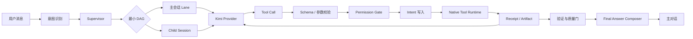
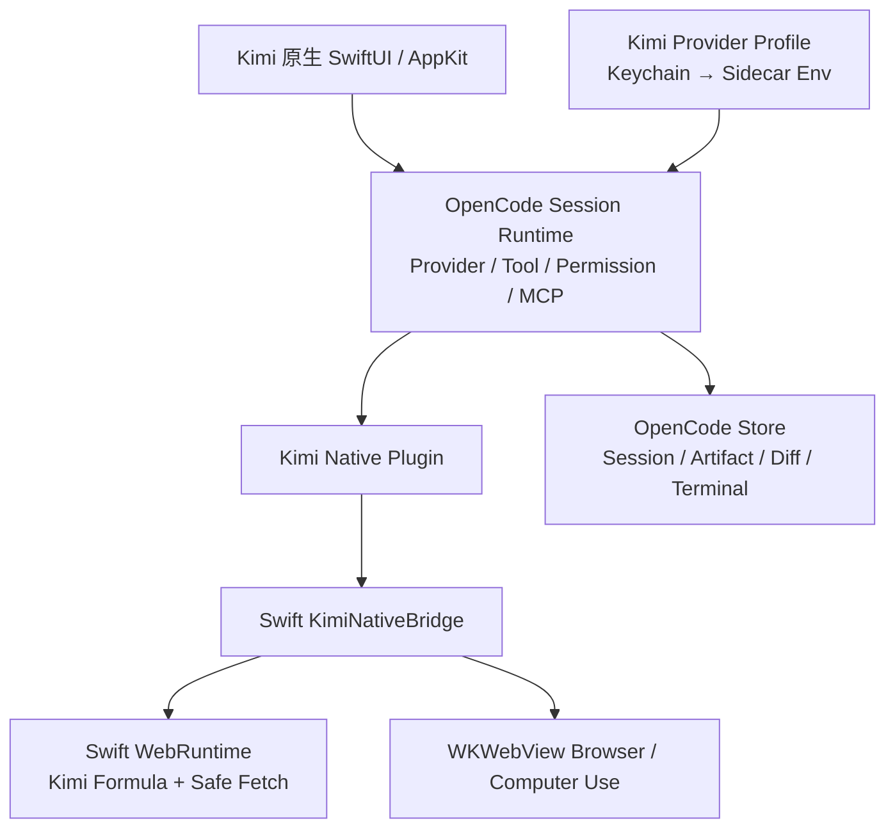

<div align="center">


# Kimi Code Agent

**基于 OpenCode 执行内核、接入 Kimi 与 macOS 原生能力的 Coding Agent 工作台**

自然对话 · Worktree 隔离 · 可审计工具 · MCP / Skills / Hooks · 可恢复执行

<p>
  
  
  
  
</p>

</div>

> 当前生产桌面工作台是 Kimi 原生 SwiftUI/AppKit；OpenCode 只作为随机 loopback 端口上的无界面执行基座。用户不需要手动安装 Node/Bun，默认在本机和隔离 Worktree 中执行，审阅 Diff 后再合并。

## 目录

- [它解决什么问题](#它解决什么问题)
- [执行闭环](#执行闭环)
- [能力地图](#能力地图)
- [快速开始](#快速开始)
- [权限与安全](#权限与安全)
- [架构](#架构)
- [项目结构](#项目结构)
- [从源码构建](#从源码构建)
- [发布与校验](#发布与校验)
- [故障排查](#故障排查)
- [当前边界](#当前边界)

## 它解决什么问题

Kimi Code Agent 的重点不是把更多按钮塞进界面，而是把一次 Coding Agent 任务变成一条可理解、可暂停、可恢复、可审计的链路：

```text
用户消息
  → 意图识别
  → Supervisor / Child Agent 调度
  → Tool Schema 校验
  → 权限判断
  → Effect Intent
  → Worktree / MCP / Browser / Terminal 执行
  → Receipt 与 Artifact
  → 测试和验证
  → 失败恢复或自动修复
  → 中文最终答案
```

主对话只展示结论、证据和下一步；工具原始 JSON、终端长输出和内部推理进入可折叠 Activity Card 或 Artifact Viewer，不污染聊天内容。

## 执行闭环



每个有副作用的工具遵循同一协议：

```text
tool_call_declared
→ input_validated
→ permission_settled
→ intent_written
→ effect_started
→ effect_settled
→ receipt_written
→ tool_result_recorded
```

## 能力地图

| 能力 | 默认执行位置 | 用户看到的结果 | 恢复语义 |
| --- | --- | --- | --- |
| 普通对话 / 解释 | Kimi API + 主会话 Lane | 直接中文回复 | 保留 SessionTree，可继续 |
| Explore / Plan / Implement / Test / Review | Child Session + DAG Worker | 阶段摘要、Diff、验证结果 | 单节点重试，不重放已结算副作用 |
| 文件读取 / 搜索 | Worktree 内 Native Runtime | 折叠活动卡片 | 只读操作可安全重试 |
| 文件写入 / Shell | Worktree + OS Sandbox | 审批、Diff、终端摘要 | Intent 无 Receipt 时标记 unknown |
| Web Search / Fetch | Swift WebRuntime；兼容模式才使用 Node Bridge | 来源、标题、正文 Artifact | 公网只读可重试，私网需拦截或审批 |
| Browser Verification | WKWebView Adapter | URL、截图、Console、验证结论 | 保留当前 URL 和失败产物 |
| Computer Use | macOS 系统权限边界 | 截图、动作回执、权限诊断 | 高风险动作逐次确认 |
| MCP Tool / Resources / Prompts | MCP Worker + Harness Adapter | Worker 状态、结果和审计 | 崩溃限次重连，不重复已有 Receipt |
| Skills / Hooks / Plugins | 隔离 Worker | 触发记录、决策、错误诊断 | 超时、取消和失败均回流 Harness |

### Agent View

```text
Needs Input → Working → Waiting Approval → Completed
                         ↘ Failed / Degraded → Retry / Resume
```

终端固定在工作区右侧；Diff、Browser、Files、Plan、Tasks、Subagents 和 Verification 都是独立面板，不把工具日志倒灌进主对话。

## 快速开始

### 1. 下载

打开 [GitHub Releases](https://github.com/shidesheng0218/kimi-code-agent/releases)，下载对应架构的 DMG 或 ZIP。

1. 双击 DMG，将 **Kimi Code Agent** 拖入“应用程序”；
2. 启动应用；
3. 在“连接设置”里选择 API Key 或 Kimi Code 登录模式；
4. 选择项目文件夹，创建任务并运行。

### 2. 配置模型

#### API Key 模式

填写 Moonshot / Kimi API Key、Base URL 和默认模型。Kimi 官方 API 的常用 Base URL：

```text
https://api.moonshot.ai/v1
```

#### Kimi Code 登录模式

按应用内网页登录指引完成授权。授权记录保存在本机凭据存储中，不会写入仓库或普通会话日志。

### 3. 运行第一个任务

1. 选择一个 Git 项目文件夹；
2. 输入自然语言任务，例如：`检查登录流程的错误处理，并补充测试`；
3. 应用按任务类型选择直接对话、Web Research 或 Explore → Plan → Implement → Test → Review；
4. 需要写入时，在审批卡片中确认；
5. 在 Diff 面板审阅修改，确认后手动合并 Worktree。

## 权限与安全

权限不是 UI 文案，而是执行前的硬边界：

| 操作 | 默认策略 | 额外边界 |
| --- | --- | --- |
| Worktree 内读取、代码搜索 | 低风险 | 解析符号链接，阻止越界读取 |
| 公网只读 Web Search / HTTPS Fetch | 任务或域名级记忆授权 | 禁止 Cookie、上传、凭据 URL 和私网目标 |
| Worktree 写入 | 审批后执行 | Worktree 外写入直接拒绝，OS Sandbox 二次限制 |
| Shell | 逐次审批 | 受限工作目录、网络默认关闭 |
| Browser 点击、输入、提交 | 逐次审批 | Browser Domain Policy 和当前页面状态校验 |
| Computer Use | 逐次审批 | 需要 Accessibility / Screen Recording 权限 |
| Git Push、PR/MR、删除 | 高风险逐次审批 | 不自动合并、不静默执行 |
| Secret | 不进入普通日志 | 只接受 Keychain / 本地凭据库引用 |

应用重启后，未完成 Operation 会进入 `suspended` / `interrupted`，用户点击继续后才恢复；已存在成功 Receipt 的副作用不会重复执行。

## 架构



### Provider 边界

Kimi API 是默认模型入口。ACP / CLI 只产生模型事件，作为兼容回退，不直接拥有文件、终端、网络或浏览器执行权。模型流会记录脱敏 Trace，支持 sparse tool-call delta、断流和重试回放。

### Session 与 Worktree

- 普通连续对话使用同一 Session 的 `main` Lane；
- Steering 进入当前运行，Follow-up 进入当前回合结束后的队列；
- 强隔离任务使用 Child Session；
- 并行 Implement Worker 使用不同 Worktree；
- Test / Review / Debug 继承产生修改的 Worktree，验证真实改动；
- 同一 Worktree 写入串行，读取和搜索可并行。

## 项目结构

```text
.
├── vendor/opencode/                 # OpenCode 1.18.18 执行内核与 Desktop 工作台（MIT）
│   ├── packages/opencode/            # Session、Tool、Permission、MCP、Skills、Hooks
│   ├── packages/desktop/             # 仅作为 OpenCode 参考源码，不进入生产包
│   └── packages/kimi-code-agent-plugin/
│                                     # Kimi Web / Browser / Computer Use 原生工具
├── macos/
│   ├── Sources/KimiAgentCore/       # Swift WebRuntime、安全策略、原生 Adapter
│   ├── Sources/KimiNativeBridge/    # OpenCode ↔ Swift JSON 原生桥接
│   └── Sources/KimiAgentCoreChecks/ # Swift 原生闭环与故障注入检查
├── src/opencode/                    # Kimi OpenCode 配置与启动环境
├── scripts/                         # 融合、打包、签名脚本
├── docs/GITHUB_RELEASES.md          # GitHub Release / 公证 Runbook
├── media/kimi.svg                   # 项目图标
└── THIRD_PARTY_NOTICES.md            # OpenCode 等第三方许可证说明
```

## 从源码构建

要求：macOS 14+、Xcode Command Line Tools、Swift 6 工具链和 Node.js。发布包自带运行所需组件，最终用户不需要另行安装 Node 或 Bun。

```bash
git clone https://github.com/shidesheng0218/kimi-code-agent.git
cd kimi-code-agent
npm install

# 旧项目的 TypeScript 检查、JS 单测、Swift CoreChecks
npm run verify

# 安装并准备 OpenCode Headless 依赖与 Kimi Profile
npm run opencode:install
npm run opencode:prepare

# 编译 Kimi 原生 SwiftUI 应用
npm run native:build

# 构建 Kimi Code Agent 的 DMG / ZIP
npm run native:package
```

常用单项检查：

```bash
npm run check
npm test
swift run --package-path macos KimiAgentCoreChecks
cd vendor/opencode/packages/core && bun test test/tool/network-policy.test.ts
cd vendor/opencode/packages/kimi-code-agent-plugin && bun test
git diff --check
```

## 发布与校验

GitHub 分发不是 App Store 分发。正式 Release 需要 Developer ID 签名和 Apple 公证；本地开发包可能使用 ad-hoc 签名。完整流程见 [`docs/GITHUB_RELEASES.md`](docs/GITHUB_RELEASES.md)。

生成包后建议执行：

```bash
unzip -t release-native/Kimi-Code-Agent-*.zip
hdiutil verify release-native/Kimi-Code-Agent-*.dmg
codesign --verify --deep --strict \
  "release-native/Kimi Code Agent.app"
```

发布说明应同时包含 DMG、ZIP、SHA256、迁移说明、已知限制和回滚说明。不要把 API Key、证书、`.p12` 或公证密码提交到仓库。

## 故障排查

### 搜索或 Fetch 失败

1. 确认已启用 Web Research；
2. 确认 Kimi API Key / Base URL 有效；
3. 公网只读 Search / Fetch 会按任务或域名复用授权；
4. `localhost`、RFC1918、链路本地、凭据 URL、上传和非 GET 请求会被拦截或要求审批；
5. 查看 Activity Card 中的 provider、HTTP 状态、fallback 和完整 Artifact。

### Computer Use 没有反应

在“系统设置 → 隐私与安全性”中为应用授予：

- 辅助功能（Accessibility）；
- 屏幕录制（Screen Recording）。

授予后完全退出并重新打开应用，再重试 `computer_use.inspect`。

### MCP Server 显示 Degraded

检查 MCP 配置中的命令、参数和工作目录。Harness 会进行握手、能力协商和有限次重连；已有成功 Receipt 不会因为重连而重复执行。Resources / Prompts 未声明时会安全隐藏，不会阻断普通 MCP Tool。

### 应用重启后任务暂停

这是预期行为：恢复引擎会把未结算 Operation 标为 `suspended` / `interrupted`，避免在没有 Receipt 的情况下自动重放写入或破坏性动作。打开 Agent View，选择继续、重试当前阶段或明确放弃。

## 当前边界

- 只维护 macOS 版本；生产桌面 UI 是 Kimi 原生 SwiftUI/AppKit，OpenCode Desktop/Electron 不进入发布包；
- 默认 Kimi API，保留 OpenCode Provider 协议与兼容 Provider；
- Browser、Computer Use、MCP、Skills、Hooks、Plugins 的真实能力受本机权限、服务配置和 Worker 状态影响；
- Computer Use 不是后台静默自动化，高风险动作始终需要用户确认；
- 本地开发包的签名和公证状态取决于发布环境；
- 未配置真实 MCP Server 时，只能验证 MCP 协议和故障恢复，不应宣称某个第三方 MCP 集成已验收。

## 维护原则

- 以真实任务闭环作为完成标准，不用能力目录冒充实现；
- OpenCode Session / Tool Registry 是默认执行链；Swift 旧 Harness 仅保留迁移、原生工具和兼容数据能力；
- 默认本地执行、Worktree 隔离、人工审阅、人工合并；
- 低风险公网只读减少重复审批，高风险和越界动作保持明确边界；
- 所有关键操作都应有事件、Intent、Receipt、Artifact 或明确失败原因。

## License

请以仓库中的许可证文件为准。第三方运行时和插件依赖遵循各自许可证；发布前请检查 `THIRD_PARTY_NOTICES.md`（如该文件存在）。
